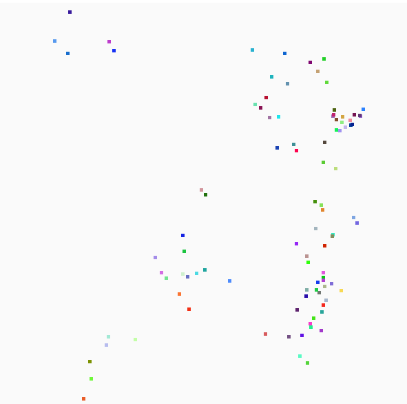

# PyGame Boids
### An Implementation of Boids in PyGame. 

Update v0.3:
Found some more silent bugs, mostly bad trig and fixed those. Adding a turning speed to make them less jittery. Did a lot of tweaking to the parameters, when the detection range for average heading was too high, they tend to converge on a single heading and get stuck there. I also ditched the PyGame built-in sprite collision as it was only used by one of the rules and just wasn't consistent with the rest of the code. I’m pretty happy with the results at this point but I still want to clean some things up as it’s all pretty messy.

Update v0.2: Some of the shortcomings were bothering me so I have continued to work on this, trying to improve my hastily written naive code. I improved teh center of mass seeking behavior, I also noticed I was calculated the movement vectors wrong, so I fixed that. Mostly improved, but still needs some work.

Update v0.1: This was a quick single day project where I wanted to try and write boids just based on my interpretation of the rules. I challenged myself not to look at any other implementations of boids during the process. It is by no means perfect or optimized but it seems to work well enough.

### Rules
1. **Separation:** steer to avoid crowding local flockmates
2. **Alignment:** steer towards the average heading of local flockmates
3. **Cohesion:** steer to move towards the average position (center of mass) of local flockmates

