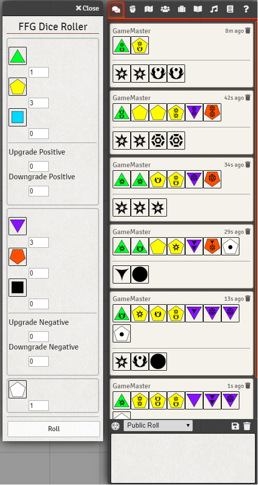

# Peter Pegues - Portfolio

## [Boids](https://github.com/petepeg/PyGame-Boids)
This was a quick single day project where I wanted to try and write Boids just based on my interpretation of the rules. I challenged myself not to look at any other implementations of Boids during the process. This turned out to be more difficult than I thought, and has taken much lounger and undergone many revisions to make them flock to my satisfaction.

### Rules
1. **Separation:** steer to avoid crowding local flockmates
2. **Alignment:** steer towards the average heading of local flockmates
3. **Cohesion:** steer to move towards the average position (center of mass) of local flockmates

## [Sudoku](https://github.com/petepeg/PySudoku)
This Sudoku solver uses backtracking to to complete the puzzle. Puzzles are generatorated by filling in random number 1-9 on the diagonal than solving. If the puzzle is solvable than numbers can be removed to create a puzzle of varying difficulty's. The application is reasonably fast solving and generating a puzzle in usually a fraction of a second.

## [Conway's Game Of Life](https://github.com/petepeg/GameOfLife)
### A quick implimentation of Conways Game of life in JavaScript and HTML.

The game follows four simple rules and demonstrates emergent behavior.
##### The Rules
1. Any live cell with fewer than two live neighbours dies, as if by underpopulation.

2. Any live cell with two or three live neighbours lives on to the next generation.

3. Any live cell with more than three live neighbours dies, as if by overpopulation.

4. Any dead cell with exactly three live neighbours becomes a live cell, as if by reproduction.

## [FFG-Roller](https://github.com/petepeg/FFG-Roller)
### A Foundry Virtual Table Top module that adds a Basic Dice roller for the Fantasy Flight Star Wars game system

This module implements the interface and logic for the Star Wars RPG by Fantasy Flight games.

