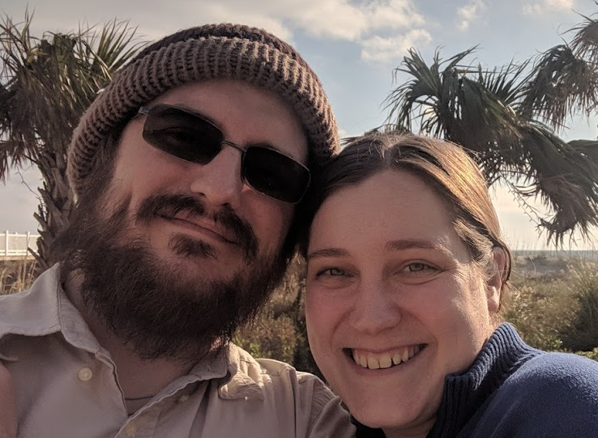

# About Me
My name is Peter Pegues and I live in Abington, PA with my wife Emily, our two dogs Jake and Skipper, and our cat Peanut. 
Some of my hobbies include painting, hiking, board games, playing Banjo, coding, dioramas/scale modeling.

# Professional Self Assessment
In putting together my portfolio I got a chance to look back over three years of course work and personal projects to try and find selections I wanted to showcase. It’s really enlightening to see the result of your hard work all laid out at once, as in the moment working piece by piece it doesn’t always seem like a lot, but it adds up. Some of my favorite projects and course work included things like creating basic data structures like linked lists in C++, collaborative object-oriented programming in java and, mobile application development for Android. 

Working in C++ was always really interesting and getting to write some implementations of basic data structures was really enlightening. Most higher-level languages take care the data structures for you, including C++. It is one thing to have a basic concept of data structures like doubly linked lists and hash tables, and it is another to implement them. I find I always learn more and understand things on a more fundamental level when I get to do them rather than just read about them. 

Working on a collaborative team project was a bit of a challenge and involved working with a group of about 20 people to develop a java application. This was a great chance to hone my code review skills, as well as become more comfortable with git. working on a collaborative project was a great experience and it was great to have a few sets of eyes on code that I wrote.

Developing a prototype mobile application involved bring a lot of various skill sets together. From creating mockups, UI’s, databases for user information, and API’s to interact with outside services like twitter and google maps. Creating just a simple prototype involved learning a little bit about a lot of stuff very quickly. It was not an environment or workflow I was used to, but I found the whole process very interesting.

 In the end I had to choose three I wanted to use to showcase my skills and how I had improved over the past three years. I chose two personal projects I had been developing and one project that was from a class I had taken. The first project and my favorite, is an implementation of Boids. Boids is a classic program developed by Craig Reynolds in 1986, that simulates flocking behaviors using three rules. Each boid follows the three rules and flocking behavior emerges as a result. The rules are separation, alignment and cohesion. They basically try not to run into each other, but also try and get to the center of the group while also maintaining the general alignment of the group. I thought this was a good example of my software design and engineering skills. 

The next application I decided to showcase was a Sudoku solver and game I wrote. Having a working solver is key to making a sudoku generator, and lets you create a digital version of the popular puzzle game. The solver uses a recursive backtracking algorithm to quickly and efficiently solve any solvable sudoku. Puzzles are generated by filling in the numbers 1-9 diagonally on an empty puzzle than solving. Once you have a completed puzzle you can remove cells to create puzzles of varying difficulty. Finally, I made it into an interactive game using PyGame which lets you generate, solve and check puzzles for completion. I included this because I think it was a good example of some advanced algorithms and efficient use of data structures.

The final program I included was a RESTful API for MongoDB using PyMongo. I had completed the initial program as part of a class but decided to develop it further and add some documentation to it. The documentation was added using Pdoc3, which generates html from docstrings within the code. The API was built for a fictitious stock exchange and implements basic create, read, update, delete operations as well as some more advanced queries. I decide to include this to showcase my knowledge in working with databases as well as creating interfaces and documentation for them.

# Projects

## [Boids](/projects/boids/boids)

## [Sudoku](/projects/sudoku/sudoku)

## [Basic PyMongo](/projects/PyMongo/pymongo)
